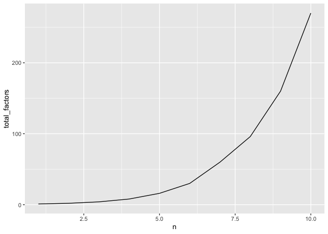

# Factors of factorials
Clare Gibson
2025-07-06

- [Introduction](#introduction)
- [Questions](#questions)
- [Analysis](#analysis)
- [Plots](#plots)
- [Conclusion](#conclusion)

# Introduction

In maths, there is a concept called **factorial** which works like this:

$$
\begin{align}
2!&=2\times1=2\\
3!&=3\times2\times1=6\\
4!&=4\times3\times2\times1=24
\end{align}
$$

The factors of an integer are the integers that divide equally into it.
The factors of $2!$ are 1 and 2. There are two factors.

$$
\begin{align}
\textsf{Factors of 2! (=2):}\\
\quad 1, 2\\
\\
\textsf{Factors of 3! (=6):}\\
\quad 1,2,3,6\\
\\
\textsf{Factors of 4! (=24):}\\
\quad 1,2,3,4,6,8,12,24
\end{align}
$$

The relationship between factorials and factors looks like this:

| $n$ | $n!$ | number of factors of $n$ |
|:----|:-----|:-------------------------|
| 1   | 1    | 1                        |
| 2   | 2    | 2                        |
| 3   | 6    | 4                        |
| 4   | 24   | 8                        |

# Questions

- How many factors has $5!$ got?
- How many factors has $6!$ got?
- What pattern do you notice?

# Analysis

In the `src/factors-of-factorials.R` script I have written a function
called `get_factors()` which takes an integer as input and returns a
list of the factors of that integer. I will load the script so that I
can use this function.

``` r
library(here)
library(tidyverse)
library(knitr)

source(here("src/factors-of-factorials.R"))
```

I can test the function using one of the integers we already outlined
above.

``` r
get_factors(6)
```

    [1] 1 2 3 6

Next, I will build a dataframe to view the relationships for a greater
set of numbers (from 0 to 10):

``` r
factors_of_factorials <- tibble(n = 1:10) |> 
  mutate(
    n_factorial = factorial(n),
    factors_of_n_factorial = map(n_factorial, get_factors),
    total_factors = map_int(factors_of_n_factorial, length)
  )

kable(factors_of_factorials)
```

| n | n_factorial | factors_of_n_factorial | total_factors |
|---:|---:|:---|---:|
| 1 | 1 | 1 | 1 |
| 2 | 2 | 1, 2 | 2 |
| 3 | 6 | 1, 2, 3, 6 | 4 |
| 4 | 24 | 1, 2, 3, 4, 6, 8, 12, 24 | 8 |
| 5 | 120 | 1, 2, 3, 4, 5, 6, 8, 10, 12, 15, 20, 24, 30, 40, 60, 120 | 16 |
| 6 | 720 | 1, 2, 3, 4, 5, 6, 8, 9, 10, 12, 15, 16, 18, 20, 24, 30, 36, 40, 45, 48, 60, 72, 80, 90, 120, 144, 180, 240, 360, 720 | 30 |
| 7 | 5040 | 1, 2, 3, 4, 5, 6, 7, 8, 9, 10, 12, 14, 15, 16, 18, 20, 21, 24, 28, 30, 35, 36, 40, 42, 45, 48, 56, 60, 63, 70, 72, 80, 84, 90, 105, 112, 120, 126, 140, 144, 168, 180, 210, 240, 252, 280, 315, 336, 360, 420, 504, 560, 630, 720, 840, 1008, 1260, 1680, 2520, 5040 | 60 |
| 8 | 40320 | 1, 2, 3, 4, 5, 6, 7, 8, 9, 10, 12, 14, 15, 16, 18, 20, 21, 24, 28, 30, 32, 35, 36, 40, 42, 45, 48, 56, 60, 63, 64, 70, 72, 80, 84, 90, 96, 105, 112, 120, 126, 128, 140, 144, 160, 168, 180, 192, 210, 224, 240, 252, 280, 288, 315, 320, 336, 360, 384, 420, 448, 480, 504, 560, 576, 630, 640, 672, 720, 840, 896, 960, 1008, 1120, 1152, 1260, 1344, 1440, 1680, 1920, 2016, 2240, 2520, 2688, 2880, 3360, 4032, 4480, 5040, 5760, 6720, 8064, 10080, 13440, 20160, 40320 | 96 |
| 9 | 362880 | 1, 2, 3, 4, 5, 6, 7, 8, 9, 10, 12, 14, 15, 16, 18, 20, 21, 24, 27, 28, 30, 32, 35, 36, 40, 42, 45, 48, 54, 56, 60, 63, 64, 70, 72, 80, 81, 84, 90, 96, 105, 108, 112, 120, 126, 128, 135, 140, 144, 160, 162, 168, 180, 189, 192, 210, 216, 224, 240, 252, 270, 280, 288, 315, 320, 324, 336, 360, 378, 384, 405, 420, 432, 448, 480, 504, 540, 560, 567, 576, 630, 640, 648, 672, 720, 756, 810, 840, 864, 896, 945, 960, 1008, 1080, 1120, 1134, 1152, 1260, 1296, 1344, 1440, 1512, 1620, 1680, 1728, 1890, 1920, 2016, 2160, 2240, 2268, 2520, 2592, 2688, 2835, 2880, 3024, 3240, 3360, 3456, 3780, 4032, 4320, 4480, 4536, 5040, 5184, 5670, 5760, 6048, 6480, 6720, 7560, 8064, 8640, 9072, 10080, 10368, 11340, 12096, 12960, 13440, 15120, 17280, 18144, 20160, 22680, 24192, 25920, 30240, 36288, 40320, 45360, 51840, 60480, 72576, 90720, 120960, 181440, 362880 | 160 |
| 10 | 3628800 | 1, 2, 3, 4, 5, 6, 7, 8, 9, 10, 12, 14, 15, 16, 18, 20, 21, 24, 25, 27, 28, 30, 32, 35, 36, 40, 42, 45, 48, 50, 54, 56, 60, 63, 64, 70, 72, 75, 80, 81, 84, 90, 96, 100, 105, 108, 112, 120, 126, 128, 135, 140, 144, 150, 160, 162, 168, 175, 180, 189, 192, 200, 210, 216, 224, 225, 240, 252, 256, 270, 280, 288, 300, 315, 320, 324, 336, 350, 360, 378, 384, 400, 405, 420, 432, 448, 450, 480, 504, 525, 540, 560, 567, 576, 600, 630, 640, 648, 672, 675, 700, 720, 756, 768, 800, 810, 840, 864, 896, 900, 945, 960, 1008, 1050, 1080, 1120, 1134, 1152, 1200, 1260, 1280, 1296, 1344, 1350, 1400, 1440, 1512, 1575, 1600, 1620, 1680, 1728, 1792, 1800, 1890, 1920, 2016, 2025, 2100, 2160, 2240, 2268, 2304, 2400, 2520, 2592, 2688, 2700, 2800, 2835, 2880, 3024, 3150, 3200, 3240, 3360, 3456, 3600, 3780, 3840, 4032, 4050, 4200, 4320, 4480, 4536, 4725, 4800, 5040, 5184, 5376, 5400, 5600, 5670, 5760, 6048, 6300, 6400, 6480, 6720, 6912, 7200, 7560, 8064, 8100, 8400, 8640, 8960, 9072, 9450, 9600, 10080, 10368, 10800, 11200, 11340, 11520, 12096, 12600, 12960, 13440, 14175, 14400, 15120, 16128, 16200, 16800, 17280, 18144, 18900, 19200, 20160, 20736, 21600, 22400, 22680, 24192, 25200, 25920, 26880, 28350, 28800, 30240, 32400, 33600, 34560, 36288, 37800, 40320, 43200, 44800, 45360, 48384, 50400, 51840, 56700, 57600, 60480, 64800, 67200, 72576, 75600, 80640, 86400, 90720, 100800, 103680, 113400, 120960, 129600, 134400, 145152, 151200, 172800, 181440, 201600, 226800, 241920, 259200, 302400, 362880, 403200, 453600, 518400, 604800, 725760, 907200, 1209600, 1814400, 3628800 | 270 |

# Plots

Finally I can plot the results on a line chart.

``` r
factors_of_factorials |> 
  ggplot(aes(x = n, y = total_factors)) +
  geom_line()
```



# Conclusion

The line chart shows that the relationship between an integer $n$ and
the number of factors that its factorial has is exponentially
increasing.
